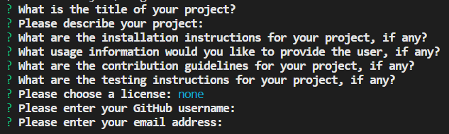

# Node.js Challenge: Professional README Generator

## Description

This project is a command line application that generates a README.md file from information provided by the user. This project provides a quick way to take in all the information needed for a README and puts it into markdown format and creates a file. This README was generated through the app. This app can save some time for any busy developer, and is very simple to use.

## Table of Contents
- [Description](#description)
- [Installation](#installation)
- [Usage](#usage)
- [License](#license)
- [Questions](#questions)

## Installation

To install the app a user needs to install node.js and run “npm install” from the cloned repository.

## Usage

To use the app a user needs to run “node index.js” from the cloned repository with an optional additional argument of the relative path of the target folder you would like the README to be generated in. If the argument is left out the README will be put in the current folder. 

The user will be prompted through a series of questions where they can type in responses that will populate the various sections of the README. A video walkthrough can be found at the following link [video walkthrough](https://drive.google.com/file/d/1S71VW9lnrZ5ran0Vt0ZiRus5ylvbWGUs/view). 

A screenshot of the prompts. 

## License

This project is under the MIT license at [MIT](https://opensource.org/licenses/MIT)

## Questions

If you have additional questions please feel free to reach out.

Github: https://www.github.com/abdallajama201

